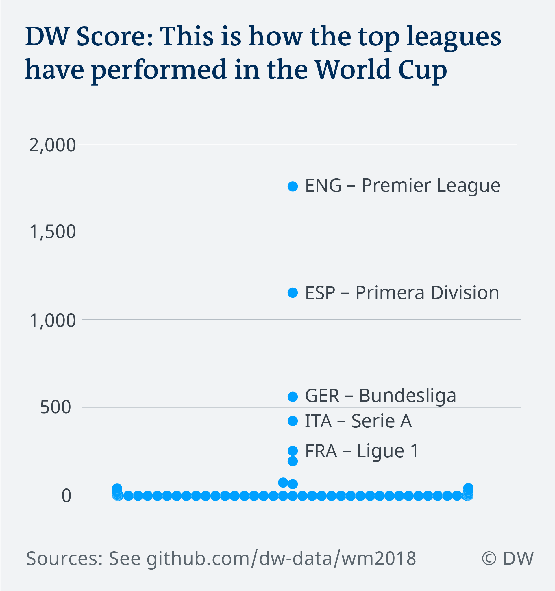
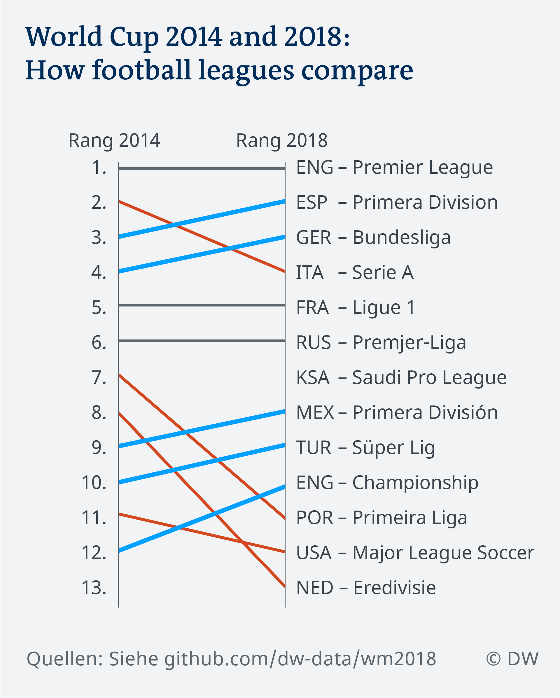

# How does my league perform at the World Cup?

Idea: Peter Wozny

Data Analysis: Eva Lopez & Gianna-Carina Grün

Reporting: David Vorholt

*To see whether our idea can work, we ran a test with the 2014 World Cup Data. Hence, for all steps, the process is documented for both years, 2014 and 2018.*

## Data sources

### 1. Squads

2014: http://resources.fifa.com/mm/document/tournament/competition/02/36/33/44/fwc_2014_squadlists_neutral.pdf

2018: https://img.fifa.com/image/upload/hzfqyndmnqazczvc5xdb.pdf

### 2. Results and goals
2014: https://github.com/openfootball/world-cup/blob/master/2014--brazil/cup.txt

2018: https://www.google.de/search?q=data+results+fifa+world+cup&oq=data+results+fifa+world+cup#sie=lg;/m/06qjc4;2;/m/030q7;st;fp;1

2018 backup: https://github.com/openfootball/world-cup/blob/master/2018--russia/cup.txt

### 3. Club - League affiliations
2014 and 2018: https://fussball.wettpoint.com/en/tables.html

### 4. Player Stats -- who played?

2014: http://www.fifa.com/worldcup/archive/brazil2014/statistics/players/distance.html

2018: http://www.kicker.de/news/fussball/weltmeisterschaft/spiele/weltmeisterschaft/2018/3/0/spieltag.html

## Data gathering and cleaning

### 1. SQUADS

- Scraping with Abbyy Fine Reader
- In the spreadsheet, add an additional column with the national team
- save as csv

**2014**
- Open in Sublime
- Replace # with 00
- Replace ^2014 with nothing
- for lines starting with \d; add a zero in front
- get rid of OCR errors that lead to lines not starting with a number between 00 and 23
- replace all lines not starting with \d\d with nothing with Regex `(^)(?!\d\d).*$`
- replace all addition header rows `00;FIFA Display Name;Last Name;First Name;Shirt Name;DOB;POS;Club;Height;Caps;Goals;WM_Mannschaft`
- replace `(` with ;
- replace `);` with ;
- add column header
- check through whether it has worked for the majority of country codes
- check for encoding errors
- check whether each of the teams has 23 entries
- Open in OpenRefine and cluster text facets over club and country

**2018**
- In Sublime replace `(\W)\((\D\D\D)\)(\,\d\d\d,\d\d\n)` with `,\2\3` and add another Column Name `CountryCodes` before the height of a player
- Double-check all country codes were separated correctly from the club name

### 2. RESULTS AND GOALS

**2014**
Were transferred manually from the link page into the same spreadsheet, derived from 1.

**2018**
We scraped them from the Google result page, listed under data sources above.

### 3. CLUB LEAGUE AFFILIATION

Information on what club played in which league was obtained by scraping the landing page of [Fußball Wettpoint](https://fussball.wettpoint.com/en/tables.html) that has a list of all football leagues per country. Subsequently, the page of each of the leagues was scanned for a 2014 data table page that was then accessed and also scraped, resulting in a list of clubs that played in each league in 2014. The same was repeated for 2018.

Information from this table were then joined with the spreadsheet from 1.

Missing information was researched manually.

### 4. PLAYER STATS

**2014**
Player stats were obtained scraping [this FIFA page](http://www.fifa.com/worldcup/archive/brazil2014/statistics/players/distance.html) containing information on matches played and minutes played. This was later joined with the spreadsheet from 1 and 3. It only contains players that played in the tournament. 

**2018**
Player stats were obtained by scraping the "tactical formation" page of each game on [Kicker](http://www.kicker.de/news/fussball/weltmeisterschaft/spiele/weltmeisterschaft/2018/1/0/spieltag.html). This was later joined with the spreadsheet from 1 and 3. It only contains players that played in the tournament. 

## Data analysis

**Key question: How to transfer points of a National Team to different leagues? Especially when several Leagues are part of one National Team?**

Things to account for in analysis:
1. A league with more players can score better
2. A leage with players scattered across teams can score better 
3. A league with more matches can score better (relates to 1 and 2)

Idea:
1. Put leagues at advantage that have more players in National teams, as it speaks for the quality of that league
2. It should not be highly relevant whether a league is scattered across many National teams or all players of a league play in the same National team

**Variables**

We define "players" as athletes who have played at least one second. 

a = Number of players by league and by national team
b = Number of all players by national team
c = Number of all players by league (irrespective of national team)
d = Success parameter
	which can take various forms
	- placement after group phase, converted to points (group first: 4 points, group second: 3 points, group third: 2 points, group last: 1 point)
	- points received during group phase (sum of points received in each individual group match)
	- average of the two

### Methodology

1. For each national team and each league: Calculate the share of players of a league in a national team (a) out of all the players in that national team (b)
2. For each national team and each league: Multiply the value of your success parameter (d) with the result of (1) to receive the proportionate amount of points for each league in each national team
3. Add up all proportionate points (2) for each league 
4. Multiply the sum of all proportionate points (3) with the number of all players of this league (c)
5. Rank by score (4)

### Results

See [this Google Spreadsheet](https://docs.google.com/spreadsheets/d/1KpNHVYXjeMxnSwtzpqraQVo8KcoRE9KiNE2Nd7X6Nq4/edit?usp=sharing) compiling all data, documenting calculation steps and for the final score for 2018. [Here](https://docs.google.com/spreadsheets/d/1WlHbR9yEpG0FdC25jVhXChNB2XwxODd-Dz7_-xxbFwo/edit?usp=sharing) you find all these details for the 2014 analysis.

#### DW Score List

|Rank | League | DW Score 2018 |
|-----|--------|---------------|
1|ENG - Premier League|1758.96
2|ESP - Primera Division|1155.28
3|GER - Bundesliga|563.28
4|ITA - Serie A|425.96
5|FRA - Ligue 1|256.17
6|RUS - Premjer-Liga|197.30
7|KSA - Saudi Pro League|66.76
8|MEX - Primera Division|75.34
9|TUR - Süper Lig|44.69
10|ENG - Championship|30.43
11|POR - Primeira Liga|42.44
12|USA - Major League Soccer|17.76
13|NED - Eredivisie|23.43
14|BEL - First Division A|20.38
15|KOR - K League|10.66
16|CHN - Super League|14.66
17|ARG - Primera Division|7.58
18|EGY - Premier League|2.01
19|JPN - J1 League|5.48
20|BRA - Serie A|6.88
21|TUN - Ligue 1|3.91
22|GER - 2. Bundesliga|2.83
23|GRE - Super League|3.65
24|IRN - Persian Gulf League|4.69
25|SCO - Premier League|3.89
26|DEN - Danish Superliga|4.71
27|CRC - Primera Division|1.17
28|COL - Categoría Primera A|0.89
29|POL - Ekstraklasa|1.52
30|SUI - Super League|1.74
31|SWE - Allsvenskan|0.89
32|GUA - Liga Nacional|0.10
33|KOR - K League Challenge|0.53
34|CHI - Primera Division Nacional|0.10
35|PER - Torneo Descentralizado de Fútbol Profesional|0.10
36|WAL - Premier League|0.45
37|SRB - SuperLiga|0.56
38|CRO - 1. HNL|2.65
39|URU - Primera Division|0.00
40|AUS - A-League|0.27
41|AUT - Bundesliga|0.88
42|QAT - Stars League|0.75
43|UAE - Premier League|0.70
44|ENG - League One|0.03
45|FIN - Veikkausliiga|0.03
46|GUI - Guinée Championnat National|0.18
47|ROU - Divizia A|0.02
48|MEX - Liga de Ascenso|0.02
49|BUL - 1. Division|0.10
50|ESP - Segunda Division|0.06
51|UKR - Premier League|0.31
52|SVK - Liga Nacional|0.02
53|WAL - Championship|0.06
54|ISL - Men's Select Division|0.06
55|FRA - Ligue 2|0.11
56|PAN - Liga Panameña de Fútbol|0.02
57|MAR - GNEF 1|0.06
58|HON - Liga Nacional|0.00
59|PAN - LPF Apertura|0.02
60|MEX - Liga de Ascenso Clausura|0.02
61|HON - Liga Nacional Apertura|0.02
62|SVK - Fortuna Liga|0.02
63|ROU - Divizia A|0.02
64|URU - Primera Division|0.00
65|BRA - Mineiro				0.00
